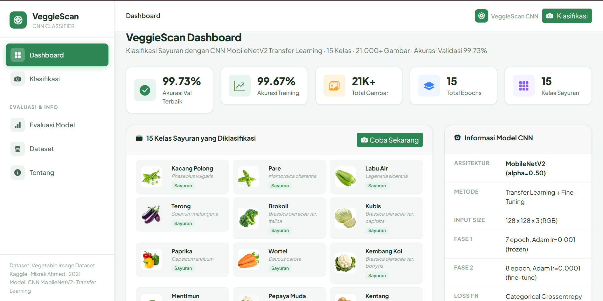
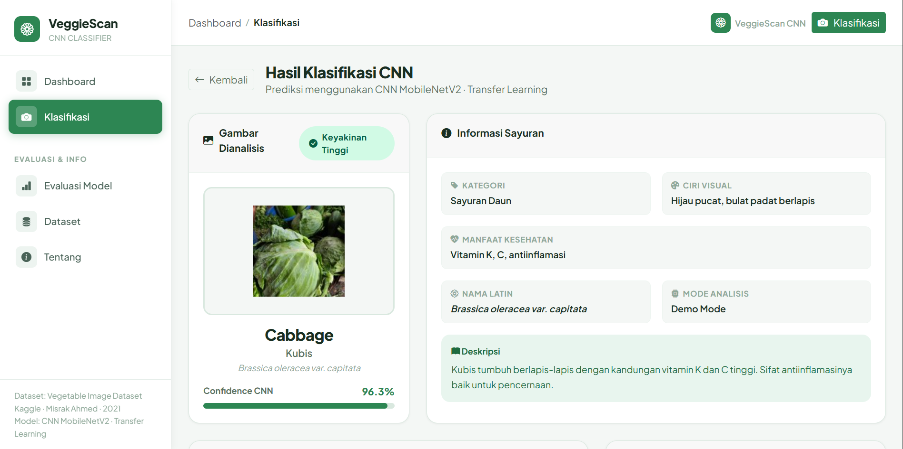

# VeggieScan - Klasifikasi Sayuran Berbasis Random Forest

Sistem klasifikasi jenis sayuran menggunakan algoritma **Random Forest** berbasis fitur warna (RGB & HSV).  
Dibangun dengan Flask, scikit-learn, dan Bootstrap 5.

[](https://python.org)
[](https://flask.palletsprojects.com)
[](https://scikit-learn.org)

---

## 🎮 Demo
🔗 **Live:** `https://alnazh-veggiescan-cnn.hf.space` 
📂 **GitHub:** `https://github.com/Alnazh/veggiescan-cnn`

---

## ✨ Fitur Utama

- 🔍 Klasifikasi 15 jenis sayuran dari foto (upload drag & drop)
- 📊 Distribusi probabilitas semua kelas secara real-time
- 🎨 Visualisasi 6 fitur warna yang diekstrak (RGB + HSV)
- 📈 Evaluasi model: Confusion Matrix, Feature Importance, Classification Report
- 📱 Tampilan responsif desktop & mobile
- 🚀 Mode demo (tanpa model) menggunakan prediksi acak

## 🥬 15 Kelas Sayuran

| # | Nama | Nama Dataset |
|---|------|-------------|
| 00 | Kacang Polong | Bean |
| 01 | Pare | Bitter_Gourd |
| 02 | Labu Air | Bottle_Gourd |
| 03 | Terong | Brinjal |
| 04 | Brokoli | Broccoli |
| 05 | Kubis | Cabbage |
| 06 | Paprika | Capsicum |
| 07 | Wortel | Carrot |
| 08 | Kembang Kol | Cauliflower |
| 09 | Mentimun | Cucumber |
| 10 | Pepaya Muda | Papaya |
| 11 | Kentang | Potato |
| 12 | Labu Kuning | Pumpkin |
| 13 | Lobak | Radish |
| 14 | Tomat | Tomato |

## 🛠️ Stack Teknologi

- **Backend**: Python 3.11, Flask 3.0, Gunicorn
- **ML**: scikit-learn (Random Forest), OpenCV, NumPy
- **Frontend**: HTML5, CSS3, Bootstrap 5.3, ApexCharts
- **Deployment**: Railway / Render / VPS + domain .my.id

## ⚡ Cara Menjalankan (Lokal)

### 1. Clone repositori
```bash
git clone https://github.com/Alnazh/veggiescan-cnn.git
cd veggiescan-cnn
```

### 2. Install dependensi
```bash
pip install -r requirements.txt
```

### 3. (Opsional) Latih model dengan dataset
```bash
# Download dataset dari Kaggle dulu, ekstrak ke folder dataset/
python train_model.py
```

### 4. Jalankan aplikasi
```bash
python app.py
```

Buka browser: `http://localhost:5000`

> **Catatan**: Tanpa model (`model/rf_model.pkl`), aplikasi berjalan dalam **mode demo** dengan prediksi acak.

## 📁 Struktur Folder

```
veggiescan/
├── app.py               # Aplikasi Flask utama
├── train_model.py       # Script pelatihan model
├── requirements.txt     # Dependensi Python
├── Procfile             # Konfigurasi deployment
├── runtime.txt          # Versi Python
├── model/
│   ├── rf_model.pkl     # Model terlatih (generate via train_model.py)
│   └── eval_results.json
├── templates/
│   ├── base.html
│   ├── dashboard.html
│   ├── klasifikasi.html
│   ├── evaluasi.html
│   ├── dataset.html
│   └── tentang.html
├── static/
│   ├── css/style.css
│   ├── js/main.js
│   └── libs/apex-charts/
└── dataset/             # Folder dataset (tidak di-commit ke Git)
    ├── Bean/
    ├── Bitter_Gourd/
    └── ...
```

## 📊 Dataset

**Vegetable Image Dataset** — Kaggle (Misrak Ahmed, 2021)  
🔗 https://www.kaggle.com/datasets/misrakahmed/vegetable-image-dataset

- 21.000+ gambar, 15 kelas, resolusi 224×224
- Distribusi seimbang ~1.400 gambar per kelas
- Lisensi: CC BY 4.0

---

## Screenshots

### Tampilan Utama


